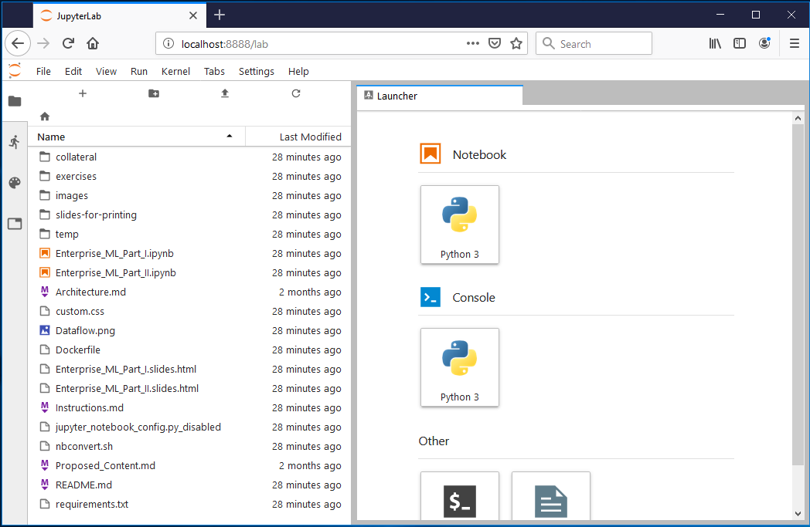

Vorbereitungen zur Übung Nr. 7 "Tensorflow: Einführung"
===

_Übung zur Gastvorlesung von Wolfgang Giersche (Zühlke) im Modul Data Analytics (M_DatAna), Bachelor Informatik, HSR Hochschule für Technik Rapperswil, FS 2019 (Prof. Stefan Keller und Raphael Das Gupta)_

## Freiwillig: Default-Browser anpassen (Windows)

Microsoft Edge stellt die JupyterLab-Oberfläche nicht richtig dar.
Falls auf Ihrem System Edge als Standard-Browser eingestellt ist,
können Sie das in den Windows-Einstellungen
unter "System" > "Default apps" ändern.
So kann Jupyter gleich einen passenden Browser starten.

Sowohl mit Firefox als auch mit Chrome funktioniert JupyterLab gut.

## Freiwillig: Installation von Git

Sie können die Dateien für die Übung als Zip-Archiv herunterladen oder das Repository mit Git auf ihren eigenen Computer clonen.

### Git-Installation auf Windows & OS X:

Laden Sie den Installer von <https://git-scm.com/downloads> herunter.

### Git-Installation auf Linux

Anleitungen für die Installation
über die Paket-Manager diverser Linux-Distributionen
finden sie unter <https://git-scm.com/download/linux>.


## Übungs-Dateien beziehen

### Variante Git:

Starten Sie die Kommandozeile (= "Terminal" = "Konsole")
bzw. auf Windows die Git-Bash
(nach der Git-Installation im Windows-Start-Menü verfügbar)
und führen Sie folgenden Befehl aus:

```bash
git clone https://github.com/smurve/HSR2019.git
```

### Variante Zip-Archiv:

Laden Sie <https://github.com/smurve/HSR2019/archive/master.zip> herunter
und entpacken Sie den Inhalt.


## Installation der benötigten Software

Für die Übung Nr. 7 vom Mittwoch, 4. April 2019, benötigen Sie Jupyter Lab mit Python, NumPy, TensorFlow und einige Python-Libraries. Bitte nehmen Sie die Installation wenn möglich bereits vorher vor.

Es gibt folgende vier Varianten zur Installation:

* A: (empfohlen für Windows) **Anaconda**
* B: (empfohlen für Linux und OS X) **Lokale Python-Installation**, Rest in Python "virtualenv"
* C: (falls A nicht klappt) **lokaler Docker-Container**
* D: (falls A & B nicht gehen) **"Binder"** im Web

### Variante A: Anaconda

**Für Windows die empfohlene Variante.**
Falls Sie jedoch bereits ein funktionierendes Setup
z.B. mit Python im Windows Subsystem for Linux (WSL)
haben,
können Sie stattdessen auch dieses weiterverwenden.
Folgen Sie dafür der Anleitung von Variante B
(Lokale Python-Installation) ab Schritt "virtualenv erstellen".

#### Anaconda-Installation

(Anleitung nur auf Windows getestet.)

1. Laden Sie von <https://www.anaconda.com/distribution/> den Anaconda-Installer (Variante "Python 3.x") für Ihr Betriebssystem herunter und starten Sie ihn.
2. Bei der Installation können Sie die Default-Werte des Installations-Assistent übernehmen und jeweils "Weiter" klicken.
   * Die Angebote "Learn more about Anaconda Cloud" und "Learn how to get started with Anaconda"
     auf dem letzten Screen des Installers können Sie natürlich getrost abwählen.

#### Conda-Environment erstellen & Dependencies installieren

1. Starten Sie Anaconda Navigator
2. Wechseln Sie auf Tab "Environments"
3. Sie können die benötigten Bibliotheken im Default-Environment "base (root)" installieren
   oder per "Create" ein dediziertes Environment für diese Übung erstellen.
   * Falls Sie ein dediziertes Environment erstellen, wählen Sie Python 3.7 aus
   (R benötigen wir nicht)
   und vergeben Sie einen sinnvollen Namen,
   z.B. `datana-df`
4. Klicken Sie auf das ▶-Symbol des zu verwendenden Environments
   und wählen Sie aus dem erscheinenden Menü "Open Terminal".
   Ein Kommandozeilen-Fenster erscheint.
   Wechseln Sie per `cd <pfad>` ins Verzeichnis,
   in dem die Übungsdateien (u.A. `requirements.txt`) liegen,
   z.B.
   ```
   cd HSR2019
   ```
6. Prüfen Sie, ob `pip` im gewählten Environment liegt:
   ```
   pip --version
   ```
   (Der mit der Version ausgegebene Pfad
   sollte im Unterverzeichnis `Anaconda3` ihres Benutzer-Verzeichnisses liegen,
   z.B. `C:\Users\HSR\Anaconda3\lib\site-packages\pip`
   oder `C:\Users\HSR\Anaconda3\envs\datana-df\lib\site-packages\pip`.)
7. Installieren Sie die in `requirements.txt` spezifizierten Python-Pakete wie folgt:
   ```
   pip install -r requirements.txt
   ```

Die Meldung
```
ERROR: apache-beam 2.12.0 has requirement mock<3.0.0,>=1.0.1, but you'll have mock 3.0.5 which is incompatible.
```
können Sie ignorieren, sofern die Installation trotzdem weiterläuft.

Gegen Ende der Ausgabe sollte `Successfully installed `... stehen.

Alernativ können Sie mit
```
echo %errorlevel%
```
auf Windows
oder mit
```bash
echo $?
```
auf OS X und Linux überprüfen,
ob alles funktioniert hat.
Ausgabe `0` bedeutet: Alles OK.


#### JupyterLab in Conda-Environment starten

(Falls das Kommandozeilen-Fenster aus dem vorherigen Abschnitt
"Conda-Environment erstellen & Dependencies installieren"
noch offen ist, können Sie dieses weiterverwenden
und bei Schritt 5 fortfahren.)

1. Starten Sie Anaconda Navigator
2. Wechseln Sie auf Tab "Environments"
3. Klicken Sie auf das ▶-Symbol des Environments,
   in dem Sie zuvor die Installation vorgenommen haben,
   und wählen Sie aus dem erscheinenden Menü "Open Terminal".
   Ein Kommandozeilen-Fenster erscheint.
4. Wechseln Sie darin per `cd <pfad>` in das Verzeichnis mit den Übungs-Dateien
5. Führen Sie folgenden Befehl aus:
   ```
   jupyter lab
   ```

Das Ergebnis sollte so aussehen:



Falls dadurch kein Browser geöffnet wurde, oder falls die Jupyter-Lab-Oberfläche darin nicht korrekt dargestellt wird (z.B. in Internet Explorer oder Edge) öffnen sie die im Terminal angezeigte URL in Firefox oder Chrome.

### Variante B: Lokale Python-Installation

**Für Linux und OS X empfohlene Variante**

#### Python-Installation notwendig?

Es kann sein, dass Python auf ihrem Computer bereits installiert ist.

Öffnen Sie ein Kommandozeiltenfenster
und prüfen Sie wie folgt,
ob Python 3 bereits installiert ist:
```bash
python3 --version
```

Falls keine Python-Version ausgegeben wird,
versuchen Sie es mit
```bash
python --version
```

Falls auch hier keine Python-Version angezeigt wird,
muss Python erst noch installiert werden.
Falls beim zweiten Befehl eine mit `2.` beginnende
Versionsnummer angezeigt wird,
können Sie Python 3 parallel zu Python 2 installieren
oder die Übung mit Python 2 durchführen.

(Python 2 und 3 können gleichzeitig installiert sein
und stören sich gegenseitig nicht.)

#### Python installieren

##### Python-Installation auf Windows

Laden Sie von <https://python.org/downloads/windows/>
den für Ihre Windows-Variante passenden
(`x86-64` für 64bit-Windows,
`x86` für 32bit-Windows)
"executable installer"
des neusten "Stable Release" herunter.

Führen Sie den Installer aus und folgen Sie
den Anweisungen des Installationsprogramms.
Achten Sie dabei darauf,
dass "Add Python to environment variables"
angewählt ist.

Falls etwas nicht klappt,
finden Sie eine ausführlichere Anleitung
unter <https://tutorial.djangogirls.org/de/python_installation/>.
Beachten Sie, dass
dort die Betriebssystem-abhängigen Schritte jener Anleitung
der Übersicht halber erst aufgeklappt werden müssen.

#### Python-Installation auf Mac OS X

> **Hinweis**
> Bevor Sie Python auf Mac OS X installieren,
> müssen Sie sicherstellen,
> dass Ihre Mac-Einstellungen es erlauben,
> Pakete zu installieren,
> die nicht aus dem App Store stammen.
> Gehen Sie auf Systemeinstellungen (im Ordner "Programme"),
> klicken Sie auf "Sicherheit"
> und dann auf die Registerkarte "Allgemein".
> Wenn "Apps-Download erlauben von:"
> auf "Mac App Store" gestellt ist,
> ändern Sie die Einstellung auf
> "Mac App Store und verifizierte Entwickler".

Laden Sie von <https://www.python.org/downloads/mac-osx/>
den für Ihre OS-X-Variante
(64-bit oder 32-bit)
passenden Installer
des neusten "Stable Release" herunter.

Starten Sie die Installation durch Doppelklick
auf die heruntergeladene `.pkg`-Datei.

#### Python-Installation auf Linux

Installieren Sie Python
über den Paket-Manager Ihrer Linux-Distribution.

Auf Debian, Ubuntu & deren Derivate:
```bash
sudo apt install python3
```

Auf Fedora und Red Hat Linux:
```bash
sudo dnf install python3
```

Auf openSUSE:
```bash
sudo zypper install python3
```

### Python-Virtualenv erzeugen & Dependencies installieren

1. Öffnen Sie ein Kommandozeilen-Fenster
2. Wechseln Sie per `cd <pfad>` ins Verzeichnis,
   in dem die Übungsdateien (u.A. `requirements.txt`) liegen,
   z.B.
   ```bash
   cd HSR2019
   ```
3. Erstellen Sie dort ein **Python "virtualenv"**.
   Eine Anleitung und Erleuterungen dazu finden Sie unter <https://tutorial.djangogirls.org/de/installation/#virtuelle-umgebung/>.[^ausklappen][^kein-django]
4. Aktivieren Sie **das "virtualenv**"  
   Eine Anleitung dazu finden Sie unter <https://tutorial.djangogirls.org/de/installation/#mit-der-virtuellen-umgebung-arbeiten>.[^ausklappen][^kein-django]
5. Installieren Sie im Terminal, in dem das "virtualenv" aktiv ist[^venv], die in der Datei `requirements.txt` spezifizierte Python-Software wie folgt:
   ```bash
   pip install -r requirements.txt
   ```

[^ausklappen]: Beachten Sie, dass dort die Betriebssystem-abhängigen Schritte jener Anleitung der Übersicht halber erst aufgeklappt werden müssen.
[^kein-django]: Nur diesen einen Abschnitt verwenden, da er Teil einer grössen Anleitung für etwas anderes ist. Django müssen Sie für die Übung nicht installieren.
[^venv]: Das können Sie an der Beschriftung `(myvenv)` am Anfang der Prompt-Zeile erkennen. Falls das in ihrem Terminal fehlt, aktivieren Sie es erneut.

Achten Sie darauf, ob Fehlermeldungen ausgegeben wurden. Nach erfolgter Installation können Sie ihr Setup wie folgt testen:

1. Starten Sie aus dem Terminal, in dem das "virtualenv" aktiv ist[^venv], Jupyter Lab:
   ```bash
   jupyter lab
   ```
   Das Ergebnis sollte so aussehen:  
   
2. Falls dadurch kein Browser geöffnet wurde, oder falls die Jupyter-Lab-Oberfläche darin nicht korrekt dargestellt wird (z.B. in Internet Explorer oder Edge) öffnen sie die im Terminal angezeigte URL in Firefox oder Chrome.
3. Starten Sie ein Python-Notebook durch den entsprechenden Button.
4. Geben Sie folgenden Python-Code in die oberste Notebook-Zelle ein:
   ```python
   from __future__ import (absolute_import, division, print_function)
   
   import numpy as np
   import pandas as pd
   import matplotlib.pyplot as plt

   import tensorflow as tf
   import seaborn as sns
   ```
5. Führen Sie die Zelle mit <kbd>⇧ Shift</kbd>+<kbd>↵ Enter</kbd> oder mit dem Run-Knopf (▶) aus.  
   Falls das zu keiner Fehlermeldung führt, sollte alles funktioniert haben.

### Variante C: Lokaler Docker-Container

(Alternative, falls Variante A nicht funktioniert).

:::info
:bulb: Hierfür muss **Docker bereits installiert** sein.
:::

Starten Sie wie folgt einen flüchtigen Docker-Container basierend auf dem Docker-Image `jupyter/tensorflow-notebook` (dieses wird hierdurch falls notwendig automatisch heruntergeladen):

Bash (OS X, Linux, oder auf Windows Git Bash oder MinGW):
```bash
docker run --rm -p 8888:8888 -e JUPYTER_ENABLE_LAB=yes -v "$PWD":/home/jovyan/work jupyter/tensorflow-notebook
```

Windows CMD:
```cmd
docker run --rm -p 8888:8888 -e JUPYTER_ENABLE_LAB=yes -v "%CD%":/home/jovyan/work jupyter/tensorflow-notebook
```

Warten Sie, bis der Container Jupyter Lab gestartet hat. Das ist der Fall, wenn ein Text wie folgender im Terminal ausgegeben wird:
```
    To access the notebook, open this file in a browser:
        file:///home/jovyan/.local/share/jupyter/runtime/nbserver-6-open.html
    Or copy and paste one of these URLs:
        http://(dee70a5e518b or 127.0.0.1):8888/?token=112bb073331f1460b73768c76dffb2f87ac1d4ca7870d46a

```

Um auf Jupyter Lab aus einem lokal laufenden Browser zuzugreifen, haben Sie zwei Möglichkeiten:

* Ändern Sie in der URL den Host-Teil auf `localhost`. Im Beispiel oben würde sich `http://localhost:8888/?token=112bb073331f1460b73768c76dffb2f87ac1d4ca7870d46a` ergeben (bei Ihnen wird das Token ein anderes sein). 
  **oder**
* Gehen Sie auf http://localhost:8888/ und kopieren Sie das Token (im Beispiel oben `112bb073331f1460b73768c76dffb2f87ac1d4ca7870d46a`; bei Ihnen wird es ein anderes sein) in das entsprechende Formular-Feld.

#### Hinweise:

* Das aktuelle Host-Verzeichnis wird im Container (und in Jupyter Lab) als `work/` eingebunden. Sie können dieses Verzeichnis sowohl vom Host als auch von Jupyter Lab aus lesen und schreiben.  
  :::danger
  :warning: Alles im Container, was ausserhalb von `work/` liegt, geht **beim Beenden des Containers verloren!**
  :::

### Variante D: "Binder" im Web

(Nur als Not-Lösung, falls A und B nicht gehen. Ist wegen geteilter spendenfinanzierter Hardware-Ressourcen vermutlich deutlich langsamer.)

"Binder" (https://mybinder.org) ist eine Plattform, auf der vorbereitete Jupyter-Notebooks samt benötigter Software ausprobiert werden können. Dazu wird für jede Benutzersitzung ein Docker-Container auf der Plattform gestartet. [Dieser wird nach einer Weile automatisch wieder beendet und gelöscht.](https://mybinder.readthedocs.io/en/latest/faq.html#how-long-will-my-binder-session-last)

:::danger
:warning: Bei der automatischen Löschung des Containers geht alles verloren, was Sie nicht explizit auf Ihren eigenen Computer heruntergeladen haben.
:::

Um eine solche Sitzung zu starten, klicken Sie auf: [](https://mybinder.org/v2/gh/smurve/HSR2019/master?urlpath=lab).


---

